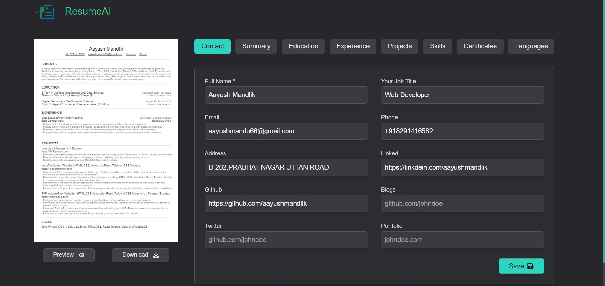
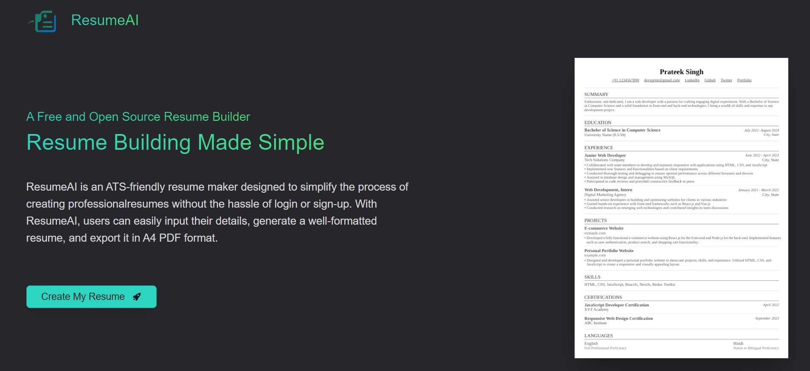

<!-- ## ResumeAI -->

<!-- ResumeAI is an ATS-friendly resume maker designed to simplify the process of creating professional resumes without the hassle of login or sign-up. With ResumeAI, users can easily input their details, generate a well-formatted resume, and export it in A4 PDF format. -->

<h1 align="center">ResumeAI</h1>
<h3 align="center">An ATS-friendly resume maker</h3>

ResumeAI is an ATS-friendly resume maker designed to simplify the process of creating professional resumes without the hassle of login or sign-up. With ResumeAI, users can easily input their details, generate a well-formatted resume, and export it in A4 PDF format. 

## Features

-   **ATS-Friendly:** Ensures compatibility with Applicant Tracking Systems (ATS) commonly used by recruiters.
-   **User-Friendly Interface:** simple and intuitive interface for easy navigation and data input.
-   **No Login Required:** Users can access all features without the need for registration or authentication.
-   **PDF Export:** Generate resumes in A4 PDF format for easy printing and sharing.
-   **Persistent Data:** Utilizes local storage to save user data, preventing loss when the browser is closed.
-   **Responsive Design:** It's designed to be responsive, ensuring a seamless experience across various devices and screen sizes.

## Technologies Used

-   **Next.js:** A React framework for building server-side rendered and static web applications.
-   **Tailwind CSS:** A utility-first CSS framework for creating custom designs with ease.
-   **Redux:** A predictable state container for managing application state.
-   **React PDF:** A library for creating PDFs using React components.

## Screenshots

